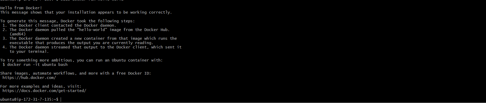

# AWS DevOps Engineer Internship Assignment

## 📌 Objective

Deploy a simple website on an AWS EC2 Ubuntu instance using Nginx, manage it through Linux commands, and version-control the project using Git and GitHub.

---

# 👨‍🎓 Student Details

- **Name:** Vivek C Raj
- **College:** Jain University
- **Course:** Master of Computer Applications (MCA)
- **Email:** vivekcraj321@gmail.com

---

# ☁️ AWS Services Used

- Amazon EC2
- Amazon VPC (Default)
- Security Groups
- Internet Gateway
- Key Pair

---

# 🛠️ Task 1 – EC2 Instance Setup

### Steps Performed

- Created an Ubuntu EC2 Instance
- Configured Security Group
- Allowed inbound ports:
  - SSH (22)
  - HTTP (80)
- Connected to EC2 using SSH and a PEM key

---

# 🐧 Task 2 – Linux Basics

### Updated Packages

```bash
sudo apt update
sudo apt upgrade -y
```

### Installed Nginx

```bash
sudo apt install nginx -y
```

### Checked Nginx Status

```bash
sudo systemctl status nginx
```

### Restarted Nginx

```bash
sudo systemctl restart nginx
```

### Disk Usage

```bash
df -h
```

### Memory Usage

```bash
free -h
```

### Running Processes

```bash
top
```

---

# 🌐 Task 3 – Website Hosting

Created a custom HTML webpage containing:

- Name
- College
- Branch
- Email
- Current Date

Replaced the default Nginx page with the custom webpage.

The website was successfully hosted using the EC2 Public IP.

---

# 💻 Task 4 – Git & GitHub

Initialized a Git repository.

```bash
git init
```

Added files.

```bash
git add .
```

Committed changes.

```bash
git commit -m "Initial commit"
```

Pushed to GitHub.

```bash
git push -u origin main
```

---

# 🐳 Bonus Task – Docker

Installed Docker.

```bash
sudo apt install docker.io -y
```

Started Docker.

```bash
sudo systemctl start docker
```

Verified Docker installation.

```bash
sudo docker run hello-world
```

Docker was successfully installed and verified.

---

# ⚠️ Problems Faced

- EC2 Instance Connect failed initially.
- Connected successfully using SSH with a PEM key.
- GitHub password authentication failed.
- Resolved authentication using a Personal Access Token (PAT).

---

# 📚 Key Learnings

- AWS EC2 provisioning
- Linux command-line administration
- Nginx installation and configuration
- Website hosting on EC2
- Git version control
- GitHub repository management
- Docker installation and container execution

---

# ⏱️ Time Taken

Approximately **4–5 Hours**

---

## 📷 Screenshots

### EC2 Dashboard


### Security Group


### SSH Login


### Website


### Docker Hello World


---

# 🔗 GitHub Repository

**Repository:**  
https://github.com/vivek65666/aws-devops-assignment

---

# ✅ Assignment Status

| Task | Status |
|------|--------|
| EC2 Setup | ✅ Completed |
| Linux Basics | ✅ Completed |
| Website Deployment | ✅ Completed |
| Git & GitHub | ✅ Completed |
| Documentation | ✅ Completed |
| Docker Bonus | ✅ Completed |

---

## Thank You
